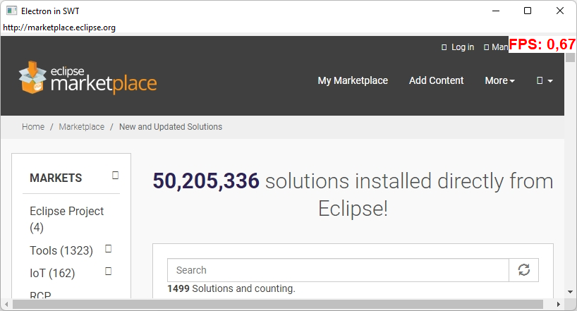
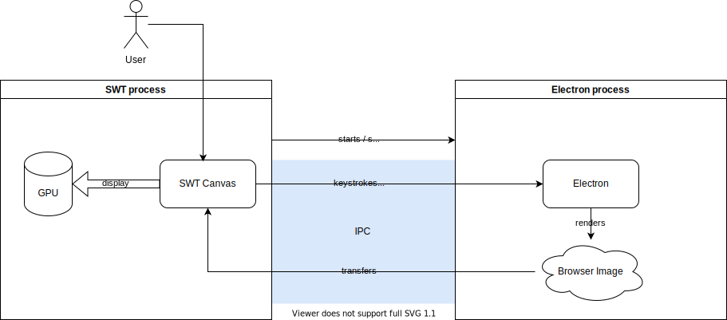

[](LICENSE)

# Electron for SWT

**Chromium browser integration for SWT based on Electron**

This prototype provides an integration of Electron in SWT. Getting an Electron-based browser into SWT is the first step towards an updated web front-end experience provided to the Eclipse IDE and its various plugins. The integration in Eclipse is currently in [development](https://github.com/YattaSolutions/org.eclipse.swt.browser.electron/issues). <br>
If you want to help, we welcome all [contributions and feedback—and we're happy to tell you more about the project](#Contributing).



# Modern browser in Eclipse

### Challenge

Open ecosystems like Eclipse play a major role in providing developers an independent and open environment to build software. Although the Eclipse IDE is a great and flexible solution for software development, one thing bothers us (and others): The current version of Eclipse uses operating system dependent, outdated browser technologies. This issue was already brought up and discussed by the [Bugzilla community](https://bugs.eclipse.org/bugs/show_bug.cgi?id=405031).

### Approach

We use Electron (started via a small node.js script) to render a given website. We are using the electron [offscreen rendering mode](https://www.electronjs.org/docs/latest/tutorial/offscreen-rendering), here. The resulting image is then transfered via IPC to an SWT process where it is finally displayed. Dirty regions are supported to speed up the transfer.

Interaction (like keystrokes) are send back to the Electron process. Such hard decoupling eliminates common issues caused by running Chromium and SWT in the same process.

Currently, communication between the Electron and the SWT process is done via socket communication. Perhaps that could be changed to shared memory in the future.



### Opportunities

Overall, providing modern web technology has leverage for many other Eclipse projects, such as the [Eclipse Marketplace Client (MPC)](https://projects.eclipse.org/projects/technology.packaging.mpc).

The current approach is rather simple, and therefore easy to maintain and integrates easily in SWT.

Moreover, having an embedded Chrome browser of the same version for every operating system also enables developers to develop and test with little overhead. We will benefit from frequent Chromium updates (via Electron), so we ensure future-proof technology with every new release cycle.

### Considerations

Proceeding with this approach requires that we're aware of the following:
1. Using software rendering may reduce the possible framerate, and WebGL and 3D CSS animations are not supported
2. Using Electron introduces dependencies to Chromium and node.js, making more security updates necessary.

In our experience, software rendering is still the best solution and should work well for most Eclipse plugins, such as the [MPC](https://projects.eclipse.org/projects/technology.packaging.mpc). Alternative solutions like GPU-accelerated offscreen rendering would reduce the framerate even further.

The Chromium and node.js updates could easily be done automatically.

### Known issues

- [Issues with SWT and retina displays for Mac](https://bugs.eclipse.org/bugs/show_bug.cgi?id=576761)

## Tech stack and credits

This project is based and dependent on the following major solutions and technologies:

- [Chromium](http://www.chromium.org/Home)
- [Electron](https://www.electronjs.org)
- [SWT](https://wiki.eclipse.org/SWT)

## Getting started

### How to build and run from source

```bash
# clone the github repository
git clone https://github.com/YattaSolutions/org.eclipse.swt.browser.electron.git
cd org.eclipse.swt.browser.electron

# build packed electron executable
cd headless-electron
npm install
npm run compile
npm run package
npm run make
cd ..

# copy packed electron executable to SWT project (for win64 - adapt for other platforms)
cp headless-electron/out/make/zip/win32/x64/headless-electron-win32-x64-0.0.1.zip de.yatta.browser.electron/src/main/resources/

# build and package the prototype
cd de.yatta.browser.electron
mvn package

# run prototype
java -jar target/browser.electron-0.0.6-SNAPSHOT-jar-with-dependencies.jar
```

## License

_Electron for SWT_ is open sourced under the [Eclipse Public License 2.0](https://www.eclipse.org/legal/epl-2.0/). This is not yet an official Eclipse project or part of SWT, but once the integration is complete we plan to submit it to the Eclipse Foundation as a project.

## Contributing

Every contribution brings us closer to a better user experience with the Eclipse IDE. Please feel free to contribute through issues, pull request or by getting in touch with us directly at opensource@yatta.de.
